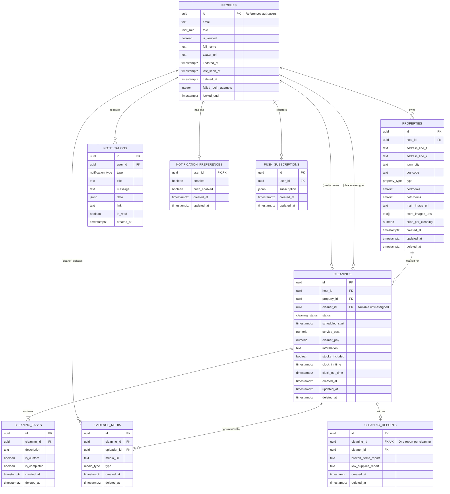

# Database Design

This document outlines the design of the database for the [Cleaner Hire PWA](/README.md).

## 1. Custom Enumerated Types

The following `ENUM` types provide structured, type-safe representations of finite sets of data:

- **user_role**: `cleaner`, `host`, `admin`
- **cleaning_status**: `requested`, `confirmed`, `in_progress`, `completed`, `cancelled`
- **property_type**: `house`, `apartment`, `studio`
- **media_type**: `image`, `video`
- **notification_type**: `cleaning_requested`, `cleaning_confirmed`, `cleaning_started`, `cleaning_completed`, `cleaning_cancelled`, `cleaning_assigned`, `cleaning_reassigned`, `cleaning_updated`, `cleaning_reminder`, `cleaning_starting_soon`, `cleaning_missed_clockin`

## 2. Entity Relationship Diagram (ERD)

